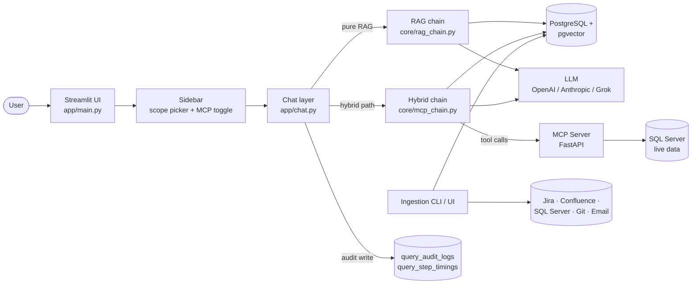
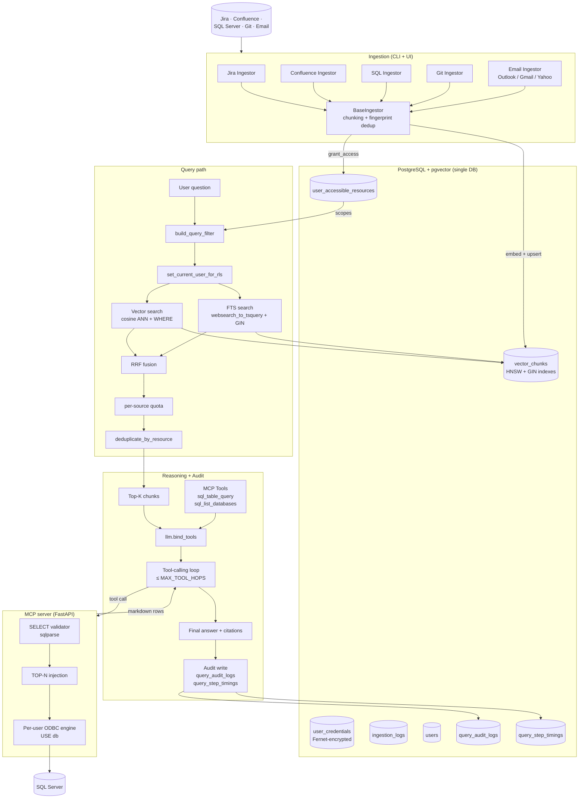
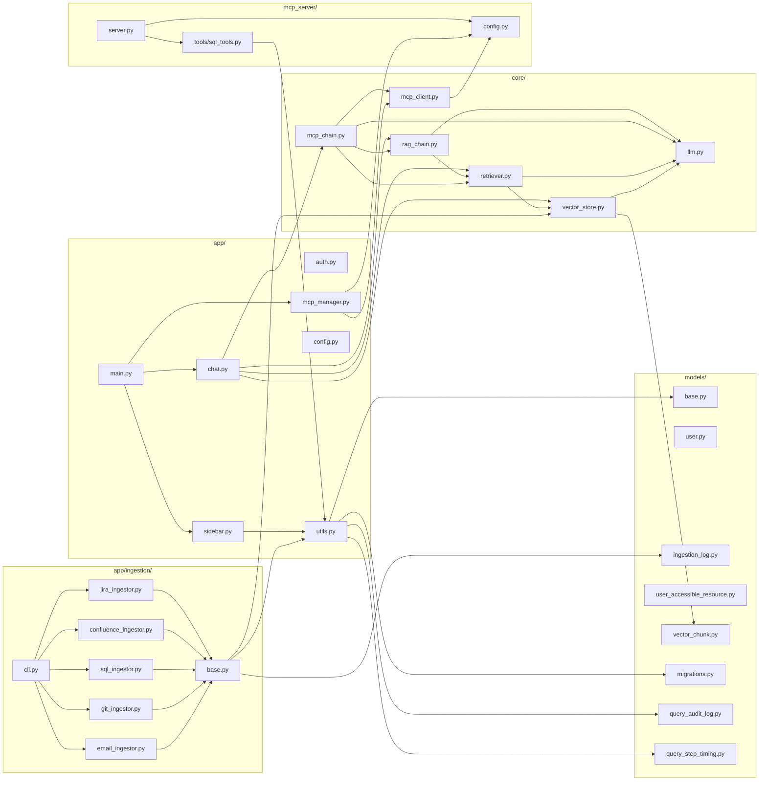

# CorporateRAG — System Documentation

> A production-ready, multi-tenant **hybrid RAG + MCP** platform that lets a whole organisation ask
> natural-language questions across **Jira**, **Confluence**, **SQL Server**, **Git (GitHub)**, and
> **Email (Outlook / Gmail / Yahoo)** — with optional **live, read-only access to SQL Server table
> data** via a Model-Context-Protocol server — from a single Streamlit chat interface, all backed by
> **PostgreSQL + pgvector**.

---

## Table of Contents

1. [Project Overview](#1-project-overview)
2. [System Architecture](#2-system-architecture)
3. [Project Layout](#3-project-layout)
4. [Core Components & File-by-File Documentation](#4-core-components--file-by-file-documentation)
   - [4.1 `app/` — Streamlit application](#41-app--streamlit-application)
   - [4.2 `app/ingestion/` — Ingestion pipeline](#42-appingestion--ingestion-pipeline)
   - [4.3 `core/` — RAG and MCP runtime](#43-core--rag-and-mcp-runtime)
   - [4.4 `mcp_server/` — Live SQL MCP server](#44-mcp_server--live-sql-mcp-server)
   - [4.5 `models/` — SQLAlchemy schema](#45-models--sqlalchemy-schema)
   - [4.6 `scripts/` — Operations utilities](#46-scripts--operations-utilities)
5. [Data Flow Walkthrough](#5-data-flow-walkthrough)
6. [MCP Integration](#6-mcp-integration)
7. [Extensibility Guide](#7-extensibility-guide)
8. [Deployment & Operations](#8-deployment--operations)
9. [Appendix](#9-appendix)

---

## 1. Project Overview

**CorporateRAG** is a unified, source-agnostic enterprise knowledge assistant. It indexes content
from your corporate systems into a single PostgreSQL database (using the `pgvector` extension) and
serves it through a Streamlit chat UI. The novel piece is the **hybrid pattern**: alongside the
classical RAG path (semantic search over historical/static content), the assistant can also call
**live tools via an MCP server** — currently a read-only SQL Server query tool — so it can answer
"what's in this row right now?" questions that semantic search alone cannot.

### Key features

- **Single-database design.** Users, encrypted credentials, ingestion logs, per-user access rows,
  audit logs, _and_ vector embeddings all live in one Postgres database — no second hop, no two-system drift.
- **Multi-source RAG.** First-class ingestors for Jira Cloud, Confluence Cloud, SQL Server
  (procs/views/tables), GitHub repositories (commits + files), and **Email** (Outlook / Microsoft
  365 via Graph API, Gmail via OAuth, Yahoo Mail via IMAP + app password).
- **Hybrid retrieval (vector + FTS + RRF).** Every retrieval query runs both a cosine ANN search
  over the HNSW index and a Postgres full-text search query in parallel. The two ranked lists are
  fused with Reciprocal Rank Fusion so rare-token queries (error codes, ticket IDs, identifiers)
  are caught by FTS even when the embedding misses them.
- **Per-source diversity quota.** A configurable `MAX_HITS_PER_SOURCE` cap prevents one noisy
  source (e.g. a dense cluster of marketing emails) from crowding out higher-scoring hits from
  other sources. Backfill from overflow keeps single-source queries whole.
- **Hybrid RAG + MCP.** A FastAPI MCP server exposes safe, read-only `sql_table_query` and
  `sql_list_databases` tools. The chat agent calls them when the user wants live row data while
  RAG continues to provide schema, documentation, and code context.
- **Multi-tenancy by query-time filter.** Vectors are stored _once_; tenancy is enforced by a
  `WHERE` clause built from the user's [`user_accessible_resources`](models/user_accessible_resource.py:1) rows.
- **PostgreSQL Row-Level Security (defence-in-depth).** When `ENABLE_RLS=true` (the default), RLS
  policies on `vector_chunks` and `user_accessible_resources` keyed on the session GUC
  `app.current_user_id` provide a database-level backstop — a regression in the app-layer filter
  can never surface another user's chunks.
- **Content fingerprint deduplication.** Every chunk is SHA-256 hashed at ingest time. If the
  fingerprint matches the stored value the chunk is skipped, saving embedding API calls on
  incremental runs where most content is unchanged.
- **Stable resource IDs + idempotent upserts.** Re-ingestion overwrites in place via
  `INSERT … ON CONFLICT DO UPDATE`.
- **HNSW ANN index.** Sub-millisecond top-K cosine search via `pgvector ≥ 0.5`, with
  `hnsw.ef_search` raised per-statement (default 200 vs the pgvector default of 40) to
  improve recall across dense multi-source corpora.
- **Encrypted credentials at rest.** Fernet-encrypted per-user connector credentials.
- **Pluggable LLMs and embeddings.** OpenAI, Anthropic, Grok; OpenAI or HuggingFace embeddings.
- **Audit logging + cost accounting.** Every user prompt writes a `query_audit_logs` row (tokens,
  cost, latency, provider/model, success) plus child `query_step_timings` rows (per-step breakdown
  for vector retrieval, each MCP tool call, LLM invocation, and post-processing). The sidebar
  exposes a live audit log view.

### High-level architecture



_Figure 1 — How users, the Streamlit app, the RAG path, the hybrid MCP path, ingestion, and audit
relate. PostgreSQL is the single source of truth for vectors, identities, access, and audit data._

---

## 2. System Architecture

### 2.1 End-to-end data flow



_Figure 2 — Full pipeline. Ingestion writes once into `vector_chunks` and grants per-user scope
access. Queries combine cosine similarity and FTS keyword search (RRF-fused) with a `WHERE` clause
derived from the user's accessible resources, plus optional RLS. The hybrid path lets the LLM call
live MCP tools. Every prompt is audited._

### 2.2 Module / component diagram



_Figure 3 — Module-level dependencies. The `app/` package is the UI; `core/` houses the RAG and
hybrid chains; `mcp_server/` is an independent FastAPI process; `models/` is the SQLAlchemy schema._

### 2.3 Why hybrid RAG + MCP?

The two patterns address fundamentally different question types:

| Pattern              | Best for                                                                   | Latency                                        | Freshness                |
| -------------------- | -------------------------------------------------------------------------- | ---------------------------------------------- | ------------------------ |
| **RAG (cosine ANN)** | Schemas, code, prose, historical context, "what does X mean?"              | Sub-ms retrieve + 1 LLM call                   | Stale (= last ingestion) |
| **MCP tool call**    | "How many rows match Y _now_?", "Show the latest 10 orders", live row data | One round-trip per tool call (~hundreds of ms) | Live                     |

A pure-RAG system can't answer _"show me the last 5 errors in `dbo.AuditLog`"_ — those rows aren't
embedded. A pure SQL agent, conversely, has no natural way to surface "what does this stored
proc do?" answers backed by code citations. By **binding MCP tools onto the LLM alongside the RAG
context**, the model picks the right tool per question. The implementation lives in
[`core/mcp_chain.py`](core/mcp_chain.py:1), which performs a small tool-calling loop until the
LLM stops requesting tools or hits `MAX_TOOL_HOPS`. The pure-RAG path remains the default, so
opt-in users get the new capability without disturbing existing behaviour.

---

## 3. Project Layout

```
rag-multi-source/
├── README.md
├── RAG-SYSTEM-DOCUMENTATION.md          # ← this file
├── requirements.txt
├── Dockerfile
├── docker-compose.yml
├── .env.example
├── .streamlit/                          # Streamlit config + MCP runtime token
│
├── app/                                 # Streamlit UI + ingestion glue
│   ├── __init__.py
│   ├── main.py                          # Streamlit entry point
│   ├── auth.py                          # bcrypt login + session helpers
│   ├── config.py                        # pydantic-settings for the app
│   ├── chat.py                          # chat panel; routes RAG vs hybrid + audit writes
│   ├── sidebar.py                       # source toggles, scope picker, MCP toggle, audit log
│   ├── utils.py                         # DB engine, Fernet, credential / access / audit helpers
│   ├── mcp_manager.py                   # supervises the MCP child process
│   └── ingestion/
│       ├── __init__.py
│       ├── base.py                      # BaseIngestor (chunk + fingerprint dedup + upsert + access grant)
│       ├── cli.py                       # `python -m app.ingestion.cli`
│       ├── jira_ingestor.py
│       ├── confluence_ingestor.py
│       ├── sql_ingestor.py
│       ├── git_ingestor.py
│       └── email_ingestor.py            # Outlook (Graph API) / Gmail (OAuth) / Yahoo (IMAP)
│
├── core/                                # RAG + MCP runtime
│   ├── __init__.py
│   ├── llm.py                           # LLM + Embeddings factories
│   ├── vector_store.py                  # upsert / delete / query-filter builder
│   ├── retriever.py                     # hybrid vector+FTS retrieval, per-source quota, RLS
│   ├── rag_chain.py                     # pure-RAG prompt + LLM call + citations + audit
│   ├── mcp_client.py                    # httpx client + LangChain StructuredTools
│   └── mcp_chain.py                     # hybrid answerer (RAG + bound MCP tools) + audit
│
├── mcp_server/                          # Independent FastAPI process
│   ├── __init__.py
│   ├── config.py                        # MCPSettings (host/port/token/limits)
│   ├── server.py                        # FastAPI app, /healthz, /mcp/tools/*
│   └── tools/
│       ├── __init__.py
│       └── sql_tools.py                 # SELECT validator, TOP cap, executor
│
├── models/                              # SQLAlchemy declarative schema
│   ├── __init__.py
│   ├── base.py                          # Base = DeclarativeBase
│   ├── user.py                          # User + UserCredential
│   ├── ingestion_log.py                 # IngestionLog
│   ├── user_accessible_resource.py      # The access table
│   ├── vector_chunk.py                  # vector_chunks (Vector(dim) + JSONB + tsvector)
│   ├── query_audit_log.py               # QueryAuditLog — one row per user prompt
│   ├── query_step_timing.py             # QueryStepTiming — per-step breakdown
│   └── migrations.py                    # idempotent schema + HNSW + GIN + RLS
│
└── scripts/                             # Operator utilities
    ├── __init__.py
    ├── debug_sql.py                     # diagnose SQL ingest visibility
    ├── gmail_get_refresh_token.py       # one-time Gmail OAuth refresh token helper
    └── vector_store_admin.py            # report / purge-source / nuke
```

---

## 4. Core Components & File-by-File Documentation

### 4.1 `app/` — Streamlit application

#### [`app/main.py`](app/main.py:1)

- **Purpose.** Streamlit entry point.
- **What it does.** Bootstraps the database (`init_db`), configures the page, gates access behind
  the auth screen, ensures the MCP server child process is running, then renders the sidebar +
  chat.
- **How it works.**
  - Suppresses noisy `transformers` and `streamlit.watcher` tracebacks before any heavy imports.
  - Inserts the project root into `sys.path` so the script works regardless of CWD.
  - Calls [`app.utils.init_db()`](app/utils.py:36) which runs the idempotent migration + pgvector
    enable.
  - Renders the login form via [`app.auth.login_page()`](app/auth.py:61) when `current_user()` is
    `None`, and stops Streamlit there.
  - Once authenticated, calls [`ensure_mcp_running()`](app/mcp_manager.py:171) **once per process**
    (cached in `st.session_state["_mcp_bootstrapped"]`).
  - Renders the sidebar (returning a [`SelectionState`](app/sidebar.py:39)) and passes it to
    `render_chat`.
- **Key relationships.** Imports from `app.utils`, `app.auth`, `app.sidebar`, `app.chat`,
  `app.mcp_manager`.
- **Snippet — MCP boot guard:**
  ```python
  if not st.session_state.get("_mcp_bootstrapped"):
      try:
          ok = ensure_mcp_running()
          st.session_state["_mcp_bootstrapped"] = True
          if not ok:
              logger.warning("MCP server failed to start …")
      except Exception:
          logger.exception("MCP bootstrap raised; continuing without it.")
          st.session_state["_mcp_bootstrapped"] = True
  ```

#### [`app/auth.py`](app/auth.py:1)

- **Purpose.** Email + bcrypt authentication and Streamlit session bootstrap.
- **What it does.** Provides `hash_password` / `verify_password` (bcrypt 12 rounds), DB lookup
  helpers, and a `login_page()` Streamlit form with separate Sign-in and Create-account tabs.
- **How it works.**
  - `current_user()` reads `st.session_state["auth_user"]` — the source of truth for "who am I?".
  - `login_session(user)` stores `{id, email}` in session state on successful sign-in.
  - `logout_session()` clears every key (defensive, prevents stale toggles bleeding across users).
- **Key relationships.** Uses [`app.utils.get_db`](app/utils.py:47) and the [`User`](models/user.py:16)
  model.
- **Notes.** Passwords never leave bcrypt-hashed form; secrets aren't logged.

#### [`app/config.py`](app/config.py:1)

- **Purpose.** Singleton `pydantic-settings` configuration.
- **What it does.** Reads `.env`, exposes typed settings: DB URL, embedding/LLM provider, chunking
  parameters, retrieval `TOP_K`, `SCORE_THRESHOLD`, `HNSW_EF_SEARCH`, `RETRIEVAL_MODE`,
  `MAX_HITS_PER_SOURCE`, `ENABLE_RLS`, `ENABLE_CONTENT_FINGERPRINT_DEDUP`, audit settings, and
  `VECTOR_UPSERT_BATCH_SIZE`.
- **How it works.** Uses `SettingsConfigDict(env_file=".env", extra="ignore")` so unknown env
  vars don't error. The computed property `embedding_dim` returns the active provider's
  dimensionality so the [`VectorChunk.embedding`](models/vector_chunk.py:76) column auto-sizes.
- **Key relationships.** Imported almost everywhere as `from app.config import settings`.

#### [`app/utils.py`](app/utils.py:1)

- **Purpose.** Shared infrastructure — DB engine/session, Fernet encryption, credential and access
  helpers, RLS GUC binding, audit helpers.
- **What it does.**
  - Builds a single SQLAlchemy `engine` and `SessionLocal` against `settings.DATABASE_URL` with
    `pool_pre_ping=True` (survives idle drops on Supabase / Neon / RDS).
  - `init_db()` defers to [`models.migrations.run_migrations`](models/migrations.py:51).
  - `get_db()` is a context-managed `Session` that auto-commits on clean exit / rolls back on
    exception.
  - `_get_fernet()` lazily constructs a `Fernet` from `ENCRYPTION_KEY`; if unset it generates one
    in-process and warns the operator.
  - `save_credential` / `load_credential` / `load_all_credentials` round-trip credentials through
    Fernet.
  - `grant_access` / `list_accessible` / `revoke_access` manipulate the multi-tenancy
    [`UserAccessibleResource`](models/user_accessible_resource.py:29) table.
  - `set_current_user_for_rls(db, user_id)` issues `SET LOCAL app.current_user_id = :uid` on the
    current session so the PostgreSQL RLS policies on `vector_chunks` / `user_accessible_resources`
    can identify the caller. No-op when `ENABLE_RLS=false` or `user_id` is `None`.
  - `log_query_audit(...)` / `log_step_timing(...)` write [`QueryAuditLog`](models/query_audit_log.py:1)
    and [`QueryStepTiming`](models/query_step_timing.py:1) rows. No-op when `AUDIT_LOG_ENABLED=false`.
  - `estimate_cost(provider, model, tokens_prompt, tokens_completion)` uses the
    `LLM_COST_PER_1K_TOKENS` rate table with longest-key-wins substring matching.
- **Snippet — context-managed session:**
  ```python
  @contextmanager
  def get_db() -> Generator[Session, None, None]:
      db = SessionLocal()
      try:
          yield db
          db.commit()
      except Exception:
          db.rollback()
          raise
      finally:
          db.close()
  ```
- **Notes.** Credentials are encrypted at rest only. If `ENCRYPTION_KEY` rotates without
  re-encryption, prior values become unreadable. The `set_current_user_for_rls` call uses
  `SET LOCAL` so it is scoped to the active transaction and never leaks across pooled connections.

#### [`app/chat.py`](app/chat.py:1)

- **Purpose.** Chat UI: turn each user message into a metadata-filtered hybrid pgvector retrieval
  and an LLM call, then render the result with citations and write audit rows.
- **What it does.**
  - `_build_filter(state)` calls
    [`build_query_filter`](core/vector_store.py:231) with the accessible scopes lists from
    the sidebar.
  - `render_chat(state)` walks `st.session_state["messages"]`, accepts a new prompt via
    `st.chat_input`, calls [`retrieve()`](core/retriever.py:280) (which runs hybrid
    vector+FTS retrieval by default), and routes to either the pure RAG
    path or [`answer_question_with_mcp()`](core/mcp_chain.py:192) when
    `state.use_mcp_sql and "sql" in state.sources`.
  - Times each step with `time.perf_counter()` and calls `log_query_audit` + per-step
    `log_step_timing` helpers after the answer is assembled.
  - `_render_citations` formats per-source badges (Jira/Confluence/SQL/Git/Email) including a
    special `⚡ SQL (live, MCP)` for synthetic citations produced by the hybrid chain.
- **Key relationships.** `app.auth`, `app.sidebar`, `core.rag_chain`, `core.retriever`,
  `core.vector_store`, `core.mcp_chain`, `app.utils`.
- **Notes.** A first-turn `st.rerun()` synchronises the sidebar's "🗑 Clear chat" disabled state
  with the now-non-empty `messages` list (Streamlit only re-renders the sidebar on the next
  interaction otherwise). A status bar tracks running session totals for prompts, tokens, cost,
  and time.

#### [`app/sidebar.py`](app/sidebar.py:1)

- **Purpose.** Sidebar — sign-out, source toggles, scope pickers, credential forms, ingestion
  trigger, MCP toggle, access management, and audit log viewer.
- **What it does.**
  - Defines the [`SelectionState`](app/sidebar.py:39) dataclass which is the contract between
    sidebar and chat.
  - `_credential_form()` renders an `st.form` per source. Secret fields default to blank (we never
    decrypt + display) but show their length so the user can confirm a value is saved.
  - `_scope_picker()` reads `list_accessible(db, user_id, source)` — the **source of truth for
    "what scopes the current user can query"**, populated by ingestion.
  - `_trigger_ingestion()` calls into [`app.ingestion.cli._make_ingestor`](app/ingestion/cli.py:40)
    and runs the chosen ingestor synchronously inside an `st.status` block with a live progress
    callback. Only `incremental` mode is exposed in the UI by design (full ingest can wipe other
    users' chunks if their scope is narrower; full mode is CLI-only).
  - `_render_mcp_status()` queries `mcp_status()` from the manager and shows a
    🟢 / 🟡 / 🔴 indicator under the MCP toggle.
  - The `🛡 Manage my access` expander surfaces `list_accessible` rows and lets the user revoke a
    scope (visibility revocation only — does not delete chunks).
  - The `📋 Audit Log` expander queries `query_audit_logs` for the current user and shows a
    filterable table (date range, success/fail) with drill-down into per-step timings.
- **Snippet — selection state:**
  ```python
  @dataclass
  class SelectionState:
      user_id: str = ""
      sources: list[str] = field(default_factory=list)
      jira_projects: list[str] = field(default_factory=list)
      confluence_spaces: list[str] = field(default_factory=list)
      sql_databases: list[str] = field(default_factory=list)
      git_scopes: list[str] = field(default_factory=list)
      email_providers: list[str] = field(default_factory=list)
      use_mcp_sql: bool = False
  ```

#### [`app/mcp_manager.py`](app/mcp_manager.py:1)

- **Purpose.** Lifecycle manager for the MCP server child process.
- **What it does.** Provides `ensure_mcp_running()` and `mcp_status()`.
- **How it works.**
  1. **Fast path.** If `/healthz` already responds 200, resolve the shared token from env →
     `.streamlit/mcp/token` → up to 2 s polling, prime the in-process [`MCPClient`](core/mcp_client.py:68),
     return `True`.
  2. **Orphan recovery.** If the server is reachable but no token is discoverable (e.g. an old
     server build that didn't publish to disk), kill the recorded PID and fall through.
  3. **Spawn.** Start `python -m mcp_server.server` as a detached child (Windows uses
     `CREATE_NEW_PROCESS_GROUP | DETACHED_PROCESS`), write a fresh token, register an `atexit`
     terminator, and wait up to ~12 s for `/healthz`.
- **Key relationships.** `core.mcp_client.get_mcp_client`, `mcp_server.config.{generate_token, mcp_settings}`.
- **Notes.** A subprocess is used (not a thread running uvicorn) because Streamlit re-executes
  the script on every interaction — running uvicorn in-process would either fight the event loop
  or leak a server per session.

### 4.2 `app/ingestion/` — Ingestion pipeline

#### [`app/ingestion/base.py`](app/ingestion/base.py:1)

- **Purpose.** Abstract `BaseIngestor` that every source-specific ingestor extends.
- **What it does.**
  - Provides the contract: subclasses set `source` and implement `fetch_resources()`,
    `scope_filter()`, `resource_identifier_for()`.
  - The base class handles chunking (a shared `RecursiveCharacterTextSplitter`), **content
    fingerprint deduplication** (SHA-256 over normalised text — if the fingerprint matches the
    stored value the chunk skips the embed call), full-vs-incremental dispatch,
    `INSERT … ON CONFLICT DO UPDATE` via [`upsert_chunks`](core/vector_store.py:121),
    per-resource pre-delete in incremental mode (so re-ingest with fewer chunks leaves no
    orphans), `IngestionLog` row management, and `grant_access()` calls into the access table.
- **Key relationships.** Calls `core.vector_store`, `app.utils.grant_access`, writes
  `IngestionLog` rows.
- **Snippet — abstract API:**

  ```python
  class BaseIngestor(ABC):
      source: str = ""

      @abstractmethod
      def fetch_resources(self, since: Optional[datetime] = None) -> Iterable[SourceResource]: ...
      @abstractmethod
      def scope_filter(self) -> dict[str, Any]: ...
      @abstractmethod
      def resource_identifier_for(self, resource: SourceResource) -> str: ...
  ```

- **Notes — full vs incremental.**
  - `full` → `delete_by_filter(scope_filter())` then re-fetch.
  - `incremental` → `since = last_successful_run.last_item_updated_at`; per-resource
    `delete_resource()` before re-upsert so chunk counts only ever shrink cleanly. Fingerprint
    dedup short-circuits the embed API call for any chunk whose body hasn't changed.

#### [`app/ingestion/cli.py`](app/ingestion/cli.py:1)

- **Purpose.** Command-line driver for ingestion (`python -m app.ingestion.cli`).
- **What it does.** Authenticates (email + bcrypt, password prompted), loads the user's encrypted
  credentials, instantiates the right ingestor via `_make_ingestor`, and calls `.run()`.
- **How it works.** `ALL_SOURCES = ["jira", "confluence", "sql", "git", "email"]` lets
  `--source all` iterate. Errors per source are caught and logged so a single bad source doesn't
  take the whole batch down. The `email` source accepts an optional `--month YYYY-MM` argument
  (translated to `--mode month` internally).
- **Key relationships.** Imported by the sidebar's `_trigger_ingestion` (UI) and used directly
  from terminals.

#### [`app/ingestion/jira_ingestor.py`](app/ingestion/jira_ingestor.py:1)

- **Purpose.** Index Jira Cloud issues + their comments.
- **What it does.** Iterates issues via the new `POST /rest/api/3/search/jql` endpoint with cursor
  pagination (`nextPageToken`) — Atlassian retired the legacy `GET /rest/api/3/search` in May 2025.
  For each issue, it produces a `SourceResource` containing the summary, description (ADF
  → text), status, type, assignee/reporter, labels, and up to `MAX_COMMENTS_PER_ISSUE = 200`
  comments (overflow comments fetched from `/rest/api/3/issue/{key}/comment`).
- **resource_id format.** `jira:{ISSUE_KEY}` (e.g. `jira:PROJ-123`).
- **resource_identifier (access table).** `project_key`.
- **Key relationships.** `app.ingestion.base.BaseIngestor`. `_extract_adf_text` walks Atlassian's
  ADF document model recursively.

#### [`app/ingestion/confluence_ingestor.py`](app/ingestion/confluence_ingestor.py:1)

- **Purpose.** Index Confluence pages, with multi-instance support.
- **What it does.**
  - Constructs an `atlassian.Confluence` client per credential set keyed by suffix (`""`, `_2`,
    `_3`, …). Secondary instances inherit the primary's email/token if not overridden.
  - For `--scope all`, discovers spaces via `get_all_spaces`; otherwise iterates the named space.
  - Renders Confluence storage-format HTML to markdown (`markdownify`, BS4 fallback).
  - Deduplicates pages across instances via `{base_url}:{page_id}`.
- **resource_id format.** `confluence:page-{page_id}`.
- **resource_identifier.** `space_key`.
- **Notes.** Uses `tenacity` exponential backoff on per-page fetches.

#### [`app/ingestion/sql_ingestor.py`](app/ingestion/sql_ingestor.py:1)

- **Purpose.** Index SQL Server **schema** (procs, functions, views, table DDL).
- **What it does.**
  - Builds a SQLAlchemy engine from the user's `conn_str`, with a `connect` event listener that
    runs `USE [db_name]` on every pooled connection — necessary because some SQL Server logins
    have a server-default DB that overrides `DATABASE=` in the ODBC string.
  - For each database in scope, iterates `INFORMATION_SCHEMA.ROUTINES`, `INFORMATION_SCHEMA.VIEWS`,
    and `INFORMATION_SCHEMA.COLUMNS` (joined to `TABLES`) and emits one `SourceResource` per
    object containing its DDL/definition.
- **resource_id format.** `sql:{server}.{db_name}.{schema}.{object_name}`. `_extract_server`
  strips `tcp:` prefix and any port for stability across deployments.
- **resource_identifier.** `db_name`.
- **Notes.** This indexes _schema only_. Live row data is served by the MCP path
  (see §6); the ingestion side never reads user data.

#### [`app/ingestion/git_ingestor.py`](app/ingestion/git_ingestor.py:1)

- **Purpose.** Index GitHub repositories — recent commits + tracked files.
- **What it does.**
  - Multi-repo support via the same `_2`, `_3`, … suffix pattern as Confluence.
  - For `--scope all` it indexes each repo's _default branch_; otherwise it tries the named branch
    on every repo, silently skipping any where the branch doesn't exist.
  - Iterates up to `max_commits` (default 200) commits and the full file tree, filtered to
    `file_extensions` (default: `.py .md .txt .yml .yaml .json .js .ts .html .css .sh .sql .toml .ini .cfg .rst`)
    and `_MAX_FILE_BYTES = 150_000`.
- **resource_id format.** `git:{owner}/{repo}@{branch}:commit:{sha}` or `…:file:{path}`.
- **resource_identifier.** `{owner}/{repo}@{branch}` (also written to the `git_scope` column).

#### [`app/ingestion/email_ingestor.py`](app/ingestion/email_ingestor.py:1)

- **Purpose.** Ingest messages from Outlook / Microsoft 365 (via the Graph API), Gmail
  (via the Google API client), and **Yahoo Mail** (via IMAP + app password), in any combination,
  from a single ingestion run.
- **Providers.** Detected from credential keys:
  - `outlook_*` keys → Outlook / M365 provider (delegated refresh-token flow preferred; client-
    credentials flow also supported).
  - `gmail_*` or `gmail_token_json` → Gmail provider.
  - `yahoo_email_address` + `yahoo_app_password` → Yahoo Mail provider (IMAP/STARTTLS to
    `imap.mail.yahoo.com:993`). Yahoo deprecated public OAuth2 for third-party apps; the supported
    integration is an account-scoped 16-character app password generated at
    login.yahoo.com → Account → Security → "Generate app password".
- **Modes.**
  - `incremental` (default) — since = last successful run's high-water mark, falling back to
    the **previous calendar month** when there is no prior log (sane first-run default).
  - `full` — wipe-then-rebuild for the configured providers (CLI-only).
  - `month` — combine with `--month YYYY-MM` to pin a specific calendar month.
- **Scope.** `all` (all configured providers), `outlook`, `gmail`, `yahoo`, or a folder/label
  name applied to every active provider (e.g. `inbox`, `INBOX`, or a Yahoo IMAP folder name
  such as `Sent`).
- **resource_id format.**
  - `email:outlook:message:{graph_id}`
  - `email:gmail:message:{gmail_id}`
  - `email:yahoo:message:{rfc822_message_id_or_uid_hash}`
- **resource_identifier.** The provider name (`outlook` | `gmail` | `yahoo`) — also written to the
  `email_provider` column on `vector_chunks` so each mailbox can be filtered / revoked
  independently.
- **Reliability.** Tenacity exponential backoff on transient HTTP errors; honours Outlook's
  `Retry-After` on 429s; HTML bodies are stripped to plain text via markdownify before
  chunking. Yahoo subject lines are wrapped in double quotes before the search query so they
  match as exact phrases rather than individual tokens.

### 4.3 `core/` — RAG and MCP runtime

#### [`core/llm.py`](core/llm.py:1)

- **Purpose.** Cached factories for the active embeddings model and chat LLM.
- **What it does.** `get_embeddings()` returns OpenAI or HuggingFace embeddings. `get_llm()`
  returns OpenAI, Anthropic, or Grok (Grok via OpenAI-compatible base URL).
- **Snippet:**
  ```python
  @lru_cache(maxsize=1)
  def get_llm() -> BaseChatModel:
      provider = settings.LLM_PROVIDER
      if provider == "openai":
          from langchain_openai import ChatOpenAI
          return ChatOpenAI(model=settings.OPENAI_CHAT_MODEL, temperature=0.1, …)
      if provider == "anthropic": …
      if provider == "grok": …
      raise ValueError(f"Unknown LLM_PROVIDER: {provider!r}")
  ```
- **Notes.** Each is `lru_cache(maxsize=1)` so the LangChain client is built exactly once per
  process.

#### [`core/vector_store.py`](core/vector_store.py:1)

- **Purpose.** All write paths into `vector_chunks`, plus the query-time **filter builder**.
- **What it does.**
  - Defines `ResourceChunk` — the dataclass each ingestor produces.
  - `upsert_chunks()` embeds and `INSERT … ON CONFLICT DO UPDATE`s by
    `(resource_id, chunk_index)`, in batches of `VECTOR_UPSERT_BATCH_SIZE`.
  - `delete_resource(resource_id)` and `delete_by_filter(filter_dict)` cover incremental and
    full deletions respectively.
  - `_PROMOTED_FIELDS = ("project_key", "space_key", "db_name", "git_scope", "email_provider")` —
    these are pulled out of `chunk.metadata` onto their own indexed columns; the rest of `metadata`
    is stored as JSONB in `extra`.
  - `build_query_filter(...)` turns sidebar selection into a structured `{"by_source": {...}}`
    dict; `filter_to_where(...)` converts that into a SQLAlchemy WHERE expression of the form
    `(source='jira' AND project_key IN (…)) OR (source='confluence' AND space_key IN (…)) OR …`.
- **Snippet — the upsert:**
  ```python
  stmt = pg_insert(VectorChunk).values(rows)
  update_cols = {c.name: stmt.excluded[c.name]
                 for c in VectorChunk.__table__.columns
                 if c.name not in {"id", "created_at"}}
  stmt = stmt.on_conflict_do_update(
      constraint="uq_vector_chunks_resource_chunk", set_=update_cols)
  ```

#### [`core/retriever.py`](core/retriever.py:1)

- **Purpose.** Hybrid vector + FTS retrieval with per-source diversity quota, RLS integration,
  and elevated HNSW recall.
- **What it does.** `retrieve(query, filter_dict, *, user_id)`:
  1. Embeds the query and fetches `TOP_K * RETRIEVAL_FETCH_MULTIPLIER` candidates from both
     the **vector search** path and (when `RETRIEVAL_MODE="hybrid"`) the **FTS keyword search**
     path, running both in the same DB transaction.
  2. **HNSW recall boost.** Issues `SET LOCAL hnsw.ef_search = {HNSW_EF_SEARCH}` before the
     vector SELECT (default 200 vs the pgvector default of 40). The `SET LOCAL` scoping means
     the change is transaction-local and never leaks to other sessions on the connection pool.
     This eliminates the "dense neighbourhood" effect where one source's cluster crowds out a
     higher-scoring chunk from another source before it even enters the candidate set.
  3. **RLS bind.** Calls `set_current_user_for_rls(db, user_id)` which issues `SET LOCAL
     app.current_user_id = :uid`. The RLS policies on `vector_chunks` then enforce tenancy at
     the database level — a defence-in-depth backstop against app-layer filter regressions.
  4. **FTS keyword search** (hybrid mode only). Runs `websearch_to_tsquery` against the
     `text_search` generated column (GIN-indexed). The score threshold is **not** applied here —
     the point of the keyword path is to surface lexical matches the embedding would miss.
     `setweight` gives title tokens weight `'A'` and body tokens weight `'B'`; `ts_rank_cd`
     honours those weights at query time.
  5. **RRF fusion.** `_rrf_fuse(vector_rows, keyword_rows, k=RRF_K)` accumulates
     `1 / (k + rank)` for each `(resource_id, chunk_index)` key across both ranked lists.
     A chunk endorsed by both retrievers receives the sum of both reciprocal ranks — exactly
     the behaviour that makes RRF surface rare-token matches without penalising semantic hits.
  6. **Per-source quota.** `_apply_source_quota(fused_rows, TOP_K, MAX_HITS_PER_SOURCE)` caps
     how many chunks any single source can contribute. If there aren't enough hits from other
     sources the retriever backfills from the overflow in score order, so single-source queries
     and narrow filters still return a full result set.
  7. Returns `list[RetrievedChunk]`.
- **`deduplicate_by_resource(hits)`.** Keeps one chunk per `resource_id` (the highest-scoring
  one). Used so the user-visible "Sources" list shows one entry per resource even when several
  chunks of the same Jira ticket / Confluence page were among the top-K.
- **Snippet — hybrid branch in `retrieve()`:**
  ```python
  if mode == "hybrid":
      keyword_rows = _run_keyword_search(
          db, query, embedding, where_clause, candidate_limit
      )
      fused_rows = _rrf_fuse(vector_rows, keyword_rows, k=int(settings.RRF_K))
  else:
      fused_rows = vector_rows

  rows = _apply_source_quota(fused_rows, top_k, max_per_source)
  ```
- **Conceptual SQL emitted (vector branch):**
  ```sql
  SET LOCAL hnsw.ef_search = 200;
  SELECT resource_id, source, chunk_index, text, title, url, …,
         1 - (embedding <=> :query_vec) AS similarity
  FROM vector_chunks
  WHERE  (source='jira'       AND project_key = ANY(:jira_projects))
      OR (source='confluence' AND space_key   = ANY(:confluence_spaces))
      …
    AND 1 - (embedding <=> :query_vec) >= :threshold
  ORDER BY embedding <=> :query_vec
  LIMIT :candidate_limit;
  ```
- **Conceptual SQL emitted (FTS branch):**
  ```sql
  SELECT …, ts_rank_cd(text_search, websearch_to_tsquery('english', :q)) AS rank
  FROM vector_chunks
  WHERE <filter clauses>
    AND text_search @@ websearch_to_tsquery('english', :q)
  ORDER BY rank DESC
  LIMIT :candidate_limit;
  ```

#### [`core/rag_chain.py`](core/rag_chain.py:1)

- **Purpose.** Pure-RAG answerer: build the prompt, call the LLM, return answer + citations.
- **What it does.** `answer_question(question, hits, history)`:
  1. Returns an "I couldn't find anything" message if `hits` is empty.
  2. Calls `deduplicate_by_resource(hits)` for the visible Sources list.
  3. `_format_context(hits, citations)` groups all chunks by `resource_id`, walks the
     deduplicated citations in order, and emits one numbered block per resource with **all** its
     chunks concatenated underneath the same number — guaranteeing the LLM's `[N]` matches the
     user-visible `[N]`.
  4. Builds messages with the `SYSTEM_PROMPT` (cite-strictly rules), up to 6 turns of history,
     and the user block. Calls `llm.invoke(messages)` and wraps the response in a `RAGAnswer`
     (which includes token usage for the audit layer).
- **Snippet — citation-numbering loop:**
  ```python
  grouped: dict[str, list[RetrievedChunk]] = {}
  for hit in hits:
      grouped.setdefault(hit.resource_id, []).append(hit)
  parts = []
  for i, citation in enumerate(citations, start=1):
      chunks = grouped.get(citation.resource_id) or [citation]
      header = f"[{i}] ({citation.source}) {citation.citation_label}"
      body = "\n\n".join(c.text.strip() for c in chunks)
      parts.append(f"{header}\n{body}")
  ```

#### [`core/mcp_client.py`](core/mcp_client.py:1)

- **Purpose.** Two layers: a plain `httpx`-based [`MCPClient`](core/mcp_client.py:68) and a
  LangChain adapter [`build_mcp_tools(user_id)`](core/mcp_client.py:226) that returns
  `StructuredTool` objects with the `user_id` curried in.
- **What it does.**
  - `MCPClient` POSTs JSON to `/mcp/tools/<name>` with the `X-MCP-Token` header. On `401` it
    re-reads `.streamlit/mcp/token` and retries once — surviving token rotations transparently.
  - `MCPToolResult.from_envelope(payload)` parses the server's standard envelope.
  - Typed methods: `sql_list_databases(user_id)`, `sql_table_query(user_id, db_name, query, max_rows)`.
  - `build_mcp_tools(user_id)` returns `[StructuredTool(sql_table_query), StructuredTool(sql_list_databases)]`
    with Pydantic args schemas and descriptions tuned for tool-calling models.
- **Snippet — currying the user:**
  ```python
  def _run_sql_query(db_name: str, query: str, max_rows: Optional[int] = None) -> str:
      result = client.sql_table_query(user_id=user_id, db_name=db_name,
                                      query=query, max_rows=max_rows)
      if not result.ok:
          return f"ERROR: {result.error}"
      return header + result.markdown
  ```
- **Notes — security.** The LLM **never sees the user_id** — it's closed over in
  `build_mcp_tools` so a hallucinated tool-call can't impersonate someone else.

#### [`core/mcp_chain.py`](core/mcp_chain.py:1)

- **Purpose.** Hybrid RAG + MCP answerer used when `state.use_mcp_sql` is on.
- **What it does.**
  1. Builds the same RAG context block as `core.rag_chain`.
  2. **Direct-SELECT fast path.** If the user's prompt itself begins with `SELECT` or `WITH`,
     execute the query directly via the MCP client (peeling off any `db.schema.table` prefix to
     resolve the right database). This works around the most common LLM failure mode (refusing
     to call a clearly-needed tool).
  3. Otherwise, calls `llm.bind_tools(build_mcp_tools(user_id))` and runs a tool-calling loop up
     to `MAX_TOOL_HOPS = 4`. Each tool call is executed via `_execute_tool_call`, which calls
     `client.sql_table_query` / `client.sql_list_databases` and feeds the markdown result back as
     a `ToolMessage`.
  4. Synthesises a [`RetrievedChunk`](core/retriever.py:27) for each successful MCP call so the
     UI's Sources list shows a `⚡ SQL (live, MCP)` entry alongside RAG citations
     (with `score = 1.0` so it sorts to the top).
  5. On any LangChain / `bind_tools` error, falls back to the pure-RAG path so a flaky MCP server
     never takes the chat down.
- **Key relationships.** `core.llm`, `core.mcp_client`, `core.rag_chain._format_context`,
  `core.retriever`, `app.utils.list_accessible`.
- **Snippet — system prompt enforces tool use:**
  ```python
  HYBRID_SYSTEM_PROMPT = """You are CorporateRAG, an enterprise assistant with TWO sources of truth …
   * If the user's question requires actual rows / values / counts / examples / latest records …
     you MUST call sql_table_query. Do NOT answer from memory or from RAG context alone …
   * If the user pastes a SQL statement, execute it directly via sql_table_query …
   * For schema, column names, stored-procedure or view definitions — use the RAG context."""
  ```

### 4.4 `mcp_server/` — Live SQL MCP server

#### [`mcp_server/config.py`](mcp_server/config.py:1)

- **Purpose.** `pydantic-settings` for the MCP service.
- **What it does.** Bind host/port (`127.0.0.1:8765` by default), auth token (`MCP_SHARED_TOKEN`,
  auto-generated via `secrets.token_urlsafe(32)` if unset), row caps (`MCP_SQL_MAX_ROWS=100`,
  `MCP_SQL_DEFAULT_ROWS=50`), per-statement timeout, log level.
- **Notes.** Loopback by default — the MCP server is internal infrastructure. Override `MCP_HOST`
  only if you mean to expose it (and put it behind a real reverse proxy).

#### [`mcp_server/server.py`](mcp_server/server.py:1)

- **Purpose.** FastAPI app exposing MCP-style tool endpoints.
- **What it does.**
  - `_RUNTIME_TOKEN = mcp_settings.MCP_SHARED_TOKEN or generate_token()` — a stable per-process
    token used for the `X-MCP-Token` header check (`require_token` dependency).
  - Lifespan hook publishes the token to `.streamlit/mcp/token` so the in-process client (and
    peers) can pick it up without env coordination.
  - Routes:
    - `GET /healthz` — liveness, no auth.
    - `GET /mcp/tools` — returns `sql_tools.TOOL_SPECS`.
    - `POST /mcp/tools/sql_list_databases` — body `{user_id}`.
    - `POST /mcp/tools/sql_table_query` — body `{user_id, db_name, query, max_rows?}`.
  - All tool responses use the `ToolEnvelope` schema (`{ok, tool, data, markdown, metadata, error}`).
- **Run standalone.**
  ```bash
  python -m mcp_server.server
  # or
  uvicorn mcp_server.server:app --host 127.0.0.1 --port 8765
  ```

#### [`mcp_server/tools/sql_tools.py`](mcp_server/tools/sql_tools.py:1)

- **Purpose.** The actual safe SQL executor + advertised `TOOL_SPECS`.
- **What it does.**
  - Defines `TOOL_SPECS` — MCP-compatible tool descriptors with `name`, `description`,
    `input_schema`. These power both the `/mcp/tools` discovery endpoint and (indirectly) the
    LangChain `StructuredTool` descriptions.
  - **`_validate_select(query)`.** Tokenises the query with `sqlparse`, requires exactly one
    statement, requires `SELECT` or `WITH` as the leading keyword, walks the token stream and
    rejects any keyword in `_FORBIDDEN_KEYWORDS` (`INSERT/UPDATE/DELETE/MERGE/DROP/CREATE/ALTER/
TRUNCATE/EXEC/EXECUTE/CALL/GRANT/REVOKE/BACKUP/RESTORE/USE/GO/DBCC/…`), and rejects
    `sp_*/xp_*/fn_*` patterns regardless of position via `_FORBIDDEN_SUBSTRINGS_RE`.
  - **`_inject_row_limit(query, max_rows)`.** Splices `TOP (max_rows)` into a bare `SELECT`, or
    wraps CTE/already-TOP queries in `SELECT TOP (max_rows) * FROM (…) AS _mcp_capped`.
  - **`_get_engine(user_id, db_name)`.** Caches one SQLAlchemy engine per `(user, db)` pair,
    rewriting the user's stored ODBC `conn_str` to pin `DATABASE=db_name` _and_ installing a
    `connect` event listener that runs `USE [db_name]` (defence-in-depth for logins with
    server-side default DBs).
  - **`table_query(user_id, db_name, query, max_rows)`.** Tenancy gate (`db_name` must be in
    `list_accessible(user_id, "sql")`), validate, cap, execute under
    `SET TRANSACTION ISOLATION LEVEL READ UNCOMMITTED`, fetch up to `cap` rows, render markdown,
    log every call (allowed or rejected) with user/db/query/duration.
  - **`list_databases(user_id)`.** Returns the user's `user_accessible_resources` rows for
    `source='sql'` as a markdown table.
- **Snippet — validator core:**
  ```python
  for token in stmt.flatten():
      if token.ttype is None:
          continue
      ttype_str = str(token.ttype)
      if "Keyword" not in ttype_str:
          continue
      if token.value.upper().strip() in _FORBIDDEN_KEYWORDS:
          raise QueryValidationError(f"Forbidden keyword in query: {token.value}")
  ```
- **Notes.** The 100-row hard ceiling is enforced server-side and the LLM cannot raise it. Every
  call is auditable through `loguru` logs.

### 4.5 `models/` — SQLAlchemy schema

#### [`models/base.py`](models/base.py:1)

The single `DeclarativeBase` shared by all model modules.

#### [`models/user.py`](models/user.py:1)

- **Purpose.** `User` (id, email, password_hash, is_active, timestamps) and `UserCredential`
  (encrypted per-source connector credentials, unique per `(user_id, source, credential_key)`).
- **Notes.** `UserCredential.encrypted_value` is a Fernet ciphertext stored as `Text`.

#### [`models/ingestion_log.py`](models/ingestion_log.py:1)

- **Purpose.** `IngestionLog` — one row per ingestion run.
- **Why it matters.** `last_item_updated_at` (ISO-8601) is the **incremental baseline**: the next
  incremental run for the same `(user, source, scope)` filters source-side fetches by
  `updated >= last_item_updated_at`.

#### [`models/user_accessible_resource.py`](models/user_accessible_resource.py:1)

- **Purpose.** _The_ multi-tenancy access table.
- **What it does.** Each row says: "user X is allowed to query `vector_chunks` whose `source`
  column equals `<source>` AND whose per-source identifier column (`project_key` / `space_key`
  / `db_name` / `git_scope` / `email_provider`) equals `<resource_identifier>`".
- **Notes.** Unique on `(user_id, source, resource_identifier)`. Populated by ingestors via
  `grant_access()`. Treat this table as the security boundary — anyone able to write into it
  can grant themselves access to any ingested scope. RLS policies (when enabled) enforce that
  each user can only SELECT / mutate their own rows.

#### [`models/vector_chunk.py`](models/vector_chunk.py:1)

- **Purpose.** The single embedding table.
- **Schema highlights.**
  - `(resource_id, chunk_index)` is unique → `INSERT … ON CONFLICT DO UPDATE` makes re-ingest a
    clean overwrite.
  - Per-source promoted columns: `project_key`, `space_key`, `db_name`, `git_scope`,
    `email_provider`. Each row populates exactly one. Each has a partial index
    (`postgresql_where=column.isnot(None)`) keeping the index small.
  - `content_fingerprint` — `CHAR(64)` SHA-256 hex of normalised chunk text. Used by
    `BaseIngestor` to skip re-embedding unchanged chunks; partial-indexed for fast equality
    lookups.
  - `text_search` — `tsvector GENERATED ALWAYS AS (…) STORED`. A Postgres generated column
    kept in sync automatically on every write. `setweight` gives title tokens weight `'A'` and
    body tokens weight `'B'` so `ts_rank_cd` at query time rewards title matches over body
    matches. The GIN index `ix_vector_chunks_text_search` drives the FTS side of hybrid
    retrieval. Not declared on the SQLAlchemy model (the column is migration-managed);
    `core.retriever` references it via `literal_column("text_search")`.
  - `extra` — JSONB column mapped to the Python attribute `extra` but the DB column name
    `metadata` (preserves backward compatibility while avoiding the SQLAlchemy reserved name).
  - `embedding = Column(Vector(settings.embedding_dim), nullable=False)`.

#### [`models/query_audit_log.py`](models/query_audit_log.py:1)

- **Purpose.** `QueryAuditLog` — one row per user prompt answered by the chat layer.
- **Schema.**
  - `id` — UUID string.
  - `user_id` — FK to `users`.
  - `timestamp` — UTC datetime, indexed.
  - `prompt_text` — truncated to `AUDIT_PROMPT_MAX_CHARS` (default 4000) at write time.
  - `total_duration_ms` — wall-clock from the chat layer's perspective.
  - `tokens_prompt`, `tokens_completion`, `estimated_cost_usd` — token usage + cost. Zero on
    the direct-SELECT MCP fast path (no LLM call).
  - `llm_provider`, `llm_model` — plain strings so adding a new provider needs no migration.
  - `success`, `error_message`.
  - `source_type` — `"rag"` | `"hybrid"` | `"mcp_only"`.
- **Relationships.** Has a one-to-many with `QueryStepTiming` (`cascade="all, delete-orphan"`).
- **Indexes.** Composite `(user_id, timestamp DESC)` for the sidebar's "last N queries by user"
  query; standalone `timestamp DESC` for admin-level cross-user views; `success`.

#### [`models/query_step_timing.py`](models/query_step_timing.py:1)

- **Purpose.** `QueryStepTiming` — one row per measured step inside a single `QueryAuditLog`.
- **Schema.**
  - `id` — UUID string.
  - `audit_id` — FK to `query_audit_logs` with `ON DELETE CASCADE`.
  - `step_name` — conventional names (see below).
  - `duration_ms`.
  - `extra` — JSONB (`metadata` in the DB) for step-specific data (row counts, hop index, etc.).
- **Step-name conventions.**

  | `step_name`                              | Emitted by                                                   |
  | ---------------------------------------- | ------------------------------------------------------------ |
  | `build_filter`                           | Both chains — time to translate sidebar to metadata filter   |
  | `vector_retrieval`                       | Both chains — pgvector top-K cosine (+ FTS in hybrid mode)   |
  | `llm_invocation`                         | RAG chain (once); hybrid chain (once per hop, `hop` in meta) |
  | `mcp_tool_call:sql_table_query`          | Hybrid chain — one per MCP tool round-trip                   |
  | `mcp_tool_call:sql_list_databases`       | Hybrid chain — one per MCP tool round-trip                   |
  | `post_processing`                        | Both chains — citation assembly, dedup, answer formatting    |
  | `total`                                  | Both chains — duplicate of `total_duration_ms` for table-only queries |

- **Indexes.** `audit_id` (FK lookup); composite `(step_name, duration_ms)` for analytics
  (`SELECT step_name, AVG(duration_ms) … GROUP BY step_name`).

#### [`models/migrations.py`](models/migrations.py:1)

- **Purpose.** Tiny idempotent migration runner.
- **What it does.**
  1. `CREATE EXTENSION IF NOT EXISTS vector` (must precede table creation).
  2. `Base.metadata.create_all(bind=engine)` — creates all declared tables (idempotent).
  3. Creates the HNSW index `ix_vector_chunks_hnsw` on `vector_chunks.embedding USING hnsw
(embedding vector_cosine_ops) WITH (m=16, ef_construction=64)` if missing.
  4. Applies `_ADDITIVE_COLUMNS` — post-launch column additions handled via `ALTER TABLE IF NOT
     EXISTS` checks:
     - `vector_chunks.email_provider` (`VARCHAR(32) NULL`) — email source.
     - `vector_chunks.content_fingerprint` (`CHAR(64) NULL`) — SHA-256 hex for fingerprint dedup.
     - `vector_chunks.text_search` (`tsvector GENERATED ALWAYS AS … STORED`) — hybrid FTS.
  5. Applies `_ADDITIVE_INDEXES` — each runs in its own transaction (failure on one doesn't
     poison the rest). Includes:
     - `ix_vector_chunks_email_provider` — partial index on `email_provider`.
     - `ix_vector_chunks_content_fingerprint` — partial index on `content_fingerprint`.
     - `ix_vector_chunks_text_search` — GIN index driving the FTS keyword side of hybrid retrieval.
     - Audit table indexes: `ix_query_audit_logs_user_ts`, `ix_query_audit_logs_timestamp`,
       `ix_query_audit_logs_success`, `ix_query_step_timings_audit_id`,
       `ix_query_step_timings_step_duration`.
  6. Applies PostgreSQL Row-Level Security policies (gated on `settings.ENABLE_RLS=True`):
     - Enables RLS on `vector_chunks` and `user_accessible_resources`.
     - Creates `vector_chunks_tenant_select` — allows SELECT only for rows whose
       `(source, promoted-identifier)` appears in the session user's `user_accessible_resources`.
     - Creates write policies (`vector_chunks_tenant_insert/update/delete`) that allow writes when
       the session GUC `app.current_user_id` is set.
     - Creates `uar_owner_*` policies so users only see / mutate their own grant rows.
     - All policies key on `current_setting('app.current_user_id', true)` set by
       `app.utils.set_current_user_for_rls` per request via `SET LOCAL`.
- **Notes.** Sub-millisecond top-K cosine search up to several million rows on a tiny instance
  with HNSW defaults. The `_index_exists` helper uses `pg_class` directly rather than
  SQLAlchemy's inspector to avoid false negatives on GIN / expression indexes that the inspector
  can silently omit on some SQLAlchemy versions.

### 4.6 `scripts/` — Operations utilities

#### [`scripts/vector_store_admin.py`](scripts/vector_store_admin.py:1)

Three strategies:

- `--strategy report` — per-source counts plus `pg_size_pretty` for the table and HNSW index.
- `--strategy purge-source --source <s>` — `DELETE FROM vector_chunks WHERE source=:s`.
- `--strategy nuke --confirm-i-know-what-im-doing` — `TRUNCATE TABLE vector_chunks RESTART IDENTITY`.

#### [`scripts/debug_sql.py`](scripts/debug_sql.py:1)

Diagnoses why the SQL ingestor isn't picking up tables. Prints (1) chunks indexed for
`source='sql'`, (2) `CURRENT_USER`, `DB_NAME()`, `SUSER_SNAME()` in the actual landed connection,
and (3) the difference between `INFORMATION_SCHEMA.TABLES`, `sys.tables`, and `sys.views` — which
distinguishes permission issues from query issues on locked-down installs.

#### [`scripts/gmail_get_refresh_token.py`](scripts/gmail_get_refresh_token.py:1)

One-time OAuth helper that runs the installed-app consent flow for Gmail and prints the resulting
refresh token to stdout. Used once per user account to obtain the `gmail_refresh_token` credential
stored in `user_credentials`. Requires `client_secret.json` (downloaded from Google Cloud Console).

---

## 5. Data Flow Walkthrough

### 5.1 Ingestion (full vs incremental)

```
User clicks "Run ingestion" (or runs CLI)
        │
        ▼
app.ingestion.cli._make_ingestor()  ← loads encrypted creds from user_credentials
        │
        ▼
BaseIngestor.run()
   ├── full        → delete_by_filter(scope_filter())
   └── incremental → since = last successful run's last_item_updated_at
        │
        ▼
fetch_resources(since)            ← per-source REST/IMAP/PyGithub iteration
        │  yields SourceResource(resource_id, title, text, url, last_updated, metadata)
        ▼
_chunk(resource)                  ← RecursiveCharacterTextSplitter
        │  → list[ResourceChunk] keyed (resource_id, chunk_index)
        ▼
fingerprint_check(chunk)          ← SHA-256 over normalised text
   ├── matches stored fingerprint → skip embed (no API call)
   └── new / changed             → embed(text)
        │
        ▼
delete_resource(resource_id)      ← incremental only (full already wiped)
upsert_chunks(chunks)             ← INSERT … ON CONFLICT DO UPDATE
        │
        ▼
grant_access(user_id, source, identifier)
        │
        ▼
IngestionLog row updated (status, items_processed, vectors_upserted, last_item_updated_at)
```

**Why two modes?** Incremental is the user-facing default (cheap, only re-embeds changed items;
fingerprint dedup saves embed calls even for touched resources whose body is unchanged).
Full is a CLI-only admin operation because `delete_by_filter` deletes by **metadata filter** —
not by `user_id` — so a full run from a user with a narrower view than the previous ingestor
would silently delete the other user's chunks.

### 5.2 Chat / query flow

```mermaid
sequenceDiagram
    autonumber
    participant U as User
    participant UI as Streamlit UI
    participant SB as Sidebar
    participant CH as Chat (app/chat.py)
    participant VS as build_query_filter
    participant R as Retriever
    participant PG as PostgreSQL + pgvector
    participant RAG as core/rag_chain
    participant HC as core/mcp_chain (hybrid)
    participant MC as MCPClient
    participant MS as MCP Server
    participant MSSQL as SQL Server
    participant LLM as LLM
    participant AUD as Audit (query_audit_logs)

    U->>UI: type prompt
    UI->>SB: render → SelectionState (sources, scopes, use_mcp_sql)
    UI->>CH: render_chat(state)
    CH->>VS: build_query_filter(sources, accessible_*)
    VS-->>CH: {by_source: {...}}
    CH->>R: retrieve(prompt, filter_dict, user_id)
    R->>PG: SET LOCAL hnsw.ef_search; SET LOCAL app.current_user_id
    R->>PG: SELECT … WHERE filter AND similarity ≥ threshold ORDER BY embedding<=>:vec LIMIT candidate_limit
    R->>PG: (hybrid) SELECT … WHERE text_search @@ websearch_to_tsquery(…) ORDER BY rank DESC LIMIT candidate_limit
    PG-->>R: vector rows + FTS rows
    R->>R: RRF fusion + per-source quota
    R-->>CH: list[RetrievedChunk]

    alt use_mcp_sql == True and "sql" in sources
        CH->>HC: answer_question_with_mcp(user_id, prompt, hits, history)
        alt prompt starts with SELECT/WITH
            HC->>MC: sql_table_query(user_id, db_name, query)
            MC->>MS: POST /mcp/tools/sql_table_query (X-MCP-Token)
            MS->>MS: _validate_select + _inject_row_limit + tenancy gate
            MS->>MSSQL: execute (USE db; SELECT TOP n …)
            MSSQL-->>MS: rows
            MS-->>MC: ToolEnvelope (markdown, metadata)
            MC-->>HC: MCPToolResult
            HC-->>CH: RAGAnswer (live data + synthetic citation)
        else free-form question
            HC->>LLM: bind_tools([sql_table_query, sql_list_databases]); invoke(messages)
            loop ≤ MAX_TOOL_HOPS
                LLM-->>HC: tool_calls?
                alt has tool_calls
                    HC->>MC: dispatch tool
                    MC->>MS: POST /mcp/tools/<tool>
                    MS-->>MC: envelope
                    MC-->>HC: ToolMessage
                else no tool_calls
                    LLM-->>HC: final text
                end
            end
            HC-->>CH: RAGAnswer (text + RAG citations + ⚡ MCP citations)
        end
    else
        CH->>RAG: answer_question(prompt, hits, history)
        RAG->>LLM: invoke(messages)
        LLM-->>RAG: final text
        RAG-->>CH: RAGAnswer
    end

    CH->>AUD: log_query_audit + log_step_timing (per step)
    CH-->>UI: render answer + Sources list + status bar update
    UI-->>U: response
```

_Figure 4 — Sequence of one user query, with both branches (pure RAG vs hybrid MCP). The
retriever now runs vector + FTS in parallel and fuses via RRF. Every prompt is audited._

### 5.3 Permissions and metadata filtering

1. **Ingestion grants access.** Every successfully processed resource calls
   [`grant_access(user_id, source, identifier)`](app/utils.py:132). The `identifier` is the
   `project_key` / `space_key` / `db_name` / `git_scope` / `email_provider` — i.e.
   **scope-level**, not item-level.
2. **Sidebar reads access.** [`_scope_picker()`](app/sidebar.py:248) calls
   [`list_accessible(db, user_id, source)`](app/utils.py:159) — the only source of truth for
   "what scopes is _this user_ allowed to query".
3. **Chat builds the filter.** `_build_filter(state)` →
   [`build_query_filter`](core/vector_store.py:231) → `{"by_source": {...}}`.
4. **Retriever turns it into SQL.** [`filter_to_where`](core/vector_store.py:269) emits
   per-source `(source = X AND <key_col> IN (...))` clauses joined with `OR`. The full SQL is the
   conjunction of that with the cosine threshold (and FTS match in hybrid mode).
5. **RLS provides defence-in-depth.** `set_current_user_for_rls(db, user_id)` issues
   `SET LOCAL app.current_user_id = :uid` before the SELECT. The `vector_chunks_tenant_select`
   policy re-checks the session user's access against `user_accessible_resources` at the database
   level. A regression in `filter_to_where` cannot surface another user's chunks.
6. **MCP also enforces tenancy.**
   [`sql_tools.table_query`](mcp_server/tools/sql_tools.py:379) re-checks
   `db_name in list_accessible(user_id, "sql")` server-side, _before_ validating or executing.
   The chat-layer filter is not the only gate — the MCP server is independently authoritative.

> **Trust model.** The `vector_chunks` table has no `user_id` column. The primary security
> boundary is the [`user_accessible_resources`](models/user_accessible_resource.py:29) table.
> PostgreSQL RLS (enabled by default) provides a second, database-level boundary keyed on the
> per-session `app.current_user_id` GUC. Together they form a two-layer defence — anyone able
> to write rows into `user_accessible_resources` can grant themselves access to any ingested
> scope, but bypassing the app-layer filter alone is insufficient when RLS is active.

---

## 6. MCP Integration

### 6.1 What the MCP server exposes

| Endpoint                             | Auth          | Purpose                                   |
| ------------------------------------ | ------------- | ----------------------------------------- |
| `GET /healthz`                       | none          | Liveness probe                            |
| `GET /mcp/tools`                     | `X-MCP-Token` | List `TOOL_SPECS` (MCP-style descriptors) |
| `POST /mcp/tools/sql_list_databases` | `X-MCP-Token` | Return the user's accessible SQL DBs      |
| `POST /mcp/tools/sql_table_query`    | `X-MCP-Token` | Validate + execute one read-only SELECT   |

Every response uses the `ToolEnvelope` shape:

```json
{
  "ok": true,
  "tool": "sql_table_query",
  "data": {
    "columns": ["id", "name"],
    "rows": [
      [1, "Alice"],
      [2, "Bob"]
    ]
  },
  "markdown": "| id | name |\n| --- | --- |\n| 1 | Alice |\n| 2 | Bob |",
  "metadata": {
    "db_name": "CustomerDemo",
    "row_count": 2,
    "row_cap": 50,
    "duration_ms": 42,
    "executed_query": "SELECT TOP (50) id, name FROM dbo.Customer"
  },
  "error": null
}
```

### 6.2 Security model

| Control                      | Where enforced                                                        | Notes                                                                                        |
| ---------------------------- | --------------------------------------------------------------------- | -------------------------------------------------------------------------------------------- |
| Loopback bind                | `mcp_settings.MCP_HOST = 127.0.0.1`                                   | Override only behind a reverse proxy                                                         |
| Shared-token auth            | `require_token` dependency                                            | Stored in `.streamlit/mcp/token`; client self-heals on 401                                   |
| Read-only validator          | `sqlparse` in [`_validate_select`](mcp_server/tools/sql_tools.py:163) | Single statement, leading `SELECT`/`WITH`, deny-list of keywords + `sp_*/xp_*/fn_*` patterns |
| Hard row cap                 | [`_inject_row_limit`](mcp_server/tools/sql_tools.py:238) + outer wrap | LLM can ask for more, server clamps to `MCP_SQL_MAX_ROWS` (100)                              |
| Per-statement timeout        | `connect_args={"timeout": MCP_SQL_QUERY_TIMEOUT_SECONDS}`             | Default 15 s                                                                                 |
| Tenancy                      | `db_name in list_accessible(user_id, "sql")`                          | Re-checked on every call, independent of chat-layer filter                                   |
| `READ UNCOMMITTED` isolation | per-connection in `table_query`                                       | Reduces lock pressure on prod servers                                                        |
| Audit log                    | `loguru` `[mcp.sql] OK/DENY/EXEC FAIL …`                              | Every call logged with user, db, query, duration                                             |

### 6.3 How the chat agent uses it

[`build_mcp_tools(user_id)`](core/mcp_client.py:226) curries the user's UUID into two
`StructuredTool`s and returns them. [`core/mcp_chain.answer_question_with_mcp`](core/mcp_chain.py:192)
calls `llm.bind_tools(tools)` and runs a tool loop, capped at `MAX_TOOL_HOPS = 4` to prevent
runaway agents.

A **direct-SELECT fast path** bypasses the LLM entirely if the user's prompt itself is (or starts
with) `SELECT`/`WITH` — this defeats the most common tool-calling failure mode where the model
refuses to call an obviously-needed tool.

---

## 7. Extensibility Guide

### 7.1 Adding a new RAG source

1. **Pick a source name.** e.g. `"slack"`. Document the `resource_id` format and what the
   per-source filter column should be (you'll likely add a new column to
   [`VectorChunk`](models/vector_chunk.py:48) such as `slack_channel`).
2. **Update the schema and migrations.** Add the column to `VectorChunk`, a partial index, and
   add it to `_PROMOTED_FIELDS` and `_FILTER_COLUMNS_BY_SOURCE` in
   [`core/vector_store.py`](core/vector_store.py:66). Add the column to `_ADDITIVE_COLUMNS` in
   [`models/migrations.py`](models/migrations.py:41) so existing deployments get it on next boot.
3. **Implement the ingestor.** Subclass [`BaseIngestor`](app/ingestion/base.py:104) in
   `app/ingestion/slack_ingestor.py`:
   ```python
   class SlackIngestor(BaseIngestor):
       source = "slack"
       def fetch_resources(self, since=None): ...   # yield SourceResource(...)
       def scope_filter(self): return {"source": "slack", "slack_channel": self.scope}
       def resource_identifier_for(self, resource): return resource.metadata["slack_channel"]
   ```
4. **Wire the CLI / UI.** Add the source to `ALL_SOURCES` in
   [`app/ingestion/cli.py`](app/ingestion/cli.py:72), add a branch in `_make_ingestor`, add a
   credential form + scope picker in [`app/sidebar.py`](app/sidebar.py:1), and extend
   [`build_query_filter`](core/vector_store.py:231) and the chat sidebar's `SelectionState`.

### 7.2 Adding a new MCP tool

1. **Author the tool module.** Mirror [`mcp_server/tools/sql_tools.py`](mcp_server/tools/sql_tools.py:1):
   - Append a descriptor to `TOOL_SPECS` (`name`, `description`, `input_schema`).
   - Implement a function that returns a `ToolResult`, with its own validator and tenancy gate.
2. **Wire endpoints.** Add `POST /mcp/tools/<source>_<tool>` routes in
   [`mcp_server/server.py`](mcp_server/server.py:1) using the `require_token` dependency and the
   `ToolEnvelope` response model.
3. **Add a typed client method.** Extend [`MCPClient`](core/mcp_client.py:68) and add a
   `StructuredTool` in `build_mcp_tools(user_id)`.
4. **Optional sidebar toggle.** Add a `use_mcp_<source>` flag on
   [`SelectionState`](app/sidebar.py:39) and route it in `app/chat.py`.

### 7.3 Adding MCP tools for new sources (Git / Confluence / Jira)

The package layout is deliberately source-pluggable. The on-the-wire format is already
MCP-compatible (`name` / `description` / `input_schema`), so swapping HTTP for
`langchain-mcp-adapters` / Anthropic stdio later is a transport change, not a redesign.

---

## 8. Deployment & Operations

### 8.1 Run the app

```bash
# 1. Provision Postgres + pgvector (Docker quickstart):
docker run -d --name corporaterag-pg \
    -e POSTGRES_PASSWORD=postgres -e POSTGRES_DB=corporaterag \
    -p 5432:5432 pgvector/pgvector:pg16

# 2. Python env
python -m venv .venv && .venv\Scripts\activate
pip install -r requirements.txt

# 3. Configure
cp .env.example .env       # set DATABASE_URL, OPENAI_API_KEY, ENCRYPTION_KEY

# 4. Launch
streamlit run app/main.py
```

On first start the app runs [`run_migrations`](models/migrations.py:436): enables `vector`,
creates tables, builds the HNSW index, adds additive columns (`email_provider`,
`content_fingerprint`, `text_search`), creates GIN + audit indexes, and applies RLS policies
when `ENABLE_RLS=true`. The MCP server is auto-started by
[`ensure_mcp_running()`](app/mcp_manager.py:171) on first authenticated load.

### 8.2 Run the MCP server standalone

```bash
export MCP_SHARED_TOKEN="$(python -c 'import secrets; print(secrets.token_urlsafe(32))')"
python -m mcp_server.server
# or
uvicorn mcp_server.server:app --host 127.0.0.1 --port 8765

# Probe:
curl http://127.0.0.1:8765/healthz
curl -H "X-MCP-Token: $MCP_SHARED_TOKEN" http://127.0.0.1:8765/mcp/tools
```

### 8.3 Ingestion commands

```bash
# Incremental (per-source + scope)
python -m app.ingestion.cli --source jira       --mode incremental --scope PROJ    --email me@org.com
python -m app.ingestion.cli --source confluence --mode incremental --scope DOCS    --email me@org.com
python -m app.ingestion.cli --source sql        --mode incremental --scope mydb    --email me@org.com
python -m app.ingestion.cli --source git        --mode incremental --scope main    --email me@org.com
python -m app.ingestion.cli --source email      --mode incremental --scope all     --email me@org.com
python -m app.ingestion.cli --source email      --mode incremental --scope outlook --email me@org.com
python -m app.ingestion.cli --source email      --month 2025-04                    --email me@org.com

# Everything at once (admin-friendly)
python -m app.ingestion.cli --source all --mode incremental --scope all --email me@org.com

# Full rebuild (CLI only — wipes by metadata filter)
python -m app.ingestion.cli --source confluence --mode full --scope DOCS --email admin@org.com
```

### 8.4 Vector store admin

```bash
python -m scripts.vector_store_admin --strategy report
python -m scripts.vector_store_admin --strategy purge-source --source email
python -m scripts.vector_store_admin --strategy nuke --confirm-i-know-what-im-doing
```

### 8.5 Environment variables (summary)

| Variable                                                | Default                                  | Purpose                                         |
| ------------------------------------------------------- | ---------------------------------------- | ----------------------------------------------- |
| `APP_SECRET_KEY`                                        | `change-me…`                             | Streamlit session signing                        |
| `ENCRYPTION_KEY`                                        | _(auto)_                                 | Fernet key for encrypted credentials            |
| `DATABASE_URL`                                          | local Postgres                           | `postgresql+psycopg://…`                         |
| `DB_POOL_SIZE` / `DB_MAX_OVERFLOW` / `DB_POOL_PRE_PING` | 5 / 10 / true                            | SQLAlchemy pool tuning                          |
| `EMBEDDINGS_PROVIDER`                                   | `openai`                                 | `openai` or `huggingface`                       |
| `OPENAI_API_KEY`                                        | —                                        | required when `EMBEDDINGS_PROVIDER=openai`      |
| `EMBEDDING_MODEL`                                       | `text-embedding-3-small`                 | OpenAI embedding model                          |
| `EMBEDDING_DIMENSION`                                   | `1536`                                   | Must match the model                            |
| `HUGGINGFACE_EMBEDDING_MODEL`                           | `sentence-transformers/all-MiniLM-L6-v2` | HF fallback                                    |
| `HF_EMBEDDING_DIMENSION`                                | `384`                                    | Match the HF model                              |
| `LLM_PROVIDER`                                          | `openai`                                 | `openai` / `anthropic` / `grok`                 |
| `OPENAI_CHAT_MODEL`                                     | `gpt-4o-mini`                            | OpenAI chat model                               |
| `ANTHROPIC_API_KEY` / `ANTHROPIC_MODEL`                 | — / `claude-sonnet-4-6`                  | Anthropic                                       |
| `GROK_API_KEY` / `GROK_BASE_URL` / `GROK_MODEL`         | — / xAI URL / `grok-2-1212`              | xAI Grok                                        |
| `CHUNK_SIZE` / `CHUNK_OVERLAP`                          | 1000 / 200                               | Text splitter                                   |
| `TOP_K`                                                 | 8                                        | Maximum chunks returned to the LLM              |
| `SCORE_THRESHOLD`                                       | 0.10                                     | Minimum cosine similarity (vector path)         |
| `HNSW_EF_SEARCH`                                        | 200                                      | HNSW graph traversal depth per query; raise for better recall on dense multi-source corpora |
| `RETRIEVAL_FETCH_MULTIPLIER`                            | 4                                        | Fetch `TOP_K × N` candidates before per-source quota |
| `MAX_HITS_PER_SOURCE`                                   | 4                                        | Per-source chunk cap (soft; backfill from overflow) |
| `RETRIEVAL_MODE`                                        | `hybrid`                                 | `vector` (cosine ANN only) or `hybrid` (vector + FTS + RRF) |
| `RRF_K`                                                 | 60                                       | RRF smoothing constant (paper default; rarely needs tuning) |
| `FTS_LANGUAGE`                                          | `english`                                | Postgres text-search config for `websearch_to_tsquery` |
| `VECTOR_UPSERT_BATCH_SIZE`                              | 250                                      | Embedding batch size                            |
| `ENABLE_RLS`                                            | `true`                                   | Apply PostgreSQL Row-Level Security on `vector_chunks` / `user_accessible_resources` |
| `ENABLE_CONTENT_FINGERPRINT_DEDUP`                      | `true`                                   | Skip re-embedding chunks whose SHA-256 fingerprint is unchanged |
| `AUDIT_LOG_ENABLED`                                     | `true`                                   | Write `query_audit_logs` + `query_step_timings` rows |
| `AUDIT_PROMPT_MAX_CHARS`                                | 4000                                     | Truncate stored prompt text to this length      |
| `MCP_HOST` / `MCP_PORT`                                 | `127.0.0.1` / `8765`                     | MCP bind                                        |
| `MCP_SHARED_TOKEN`                                      | _(auto-per-process)_                     | `X-MCP-Token`                                   |
| `MCP_SQL_MAX_ROWS` / `MCP_SQL_DEFAULT_ROWS`             | 100 / 50                                 | Row caps                                        |
| `MCP_SQL_QUERY_TIMEOUT_SECONDS`                         | 15                                       | Per-statement timeout                           |
| `MCP_LOG_LEVEL`                                         | `INFO`                                   | loguru level for the MCP server                 |

---

## 9. Appendix

### 9.1 Glossary

| Term                          | Definition                                                                                                                                                                                                                          |
| ----------------------------- | ----------------------------------------------------------------------------------------------------------------------------------------------------------------------------------------------------------------------------------- |
| **Resource**                  | A logical document fetched from a source (Jira issue, Confluence page, SQL object, Git commit/file, email message).                                                                                                                  |
| **`resource_id`**             | Stable, source-prefixed identifier of a resource. Format: `jira:PROJ-123`, `confluence:page-9876`, `sql:server.db.schema.obj`, `git:owner/repo@branch:file:path`, `email:outlook:message:{id}`, `email:gmail:message:{id}`, `email:yahoo:message:{id}`. |
| **Chunk**                     | A sub-segment of a resource produced by `RecursiveCharacterTextSplitter`, stored as a row in `vector_chunks` keyed `(resource_id, chunk_index)`.                                                                                    |
| **Promoted field**            | A metadata key materialised into its own indexed column (`project_key` / `space_key` / `db_name` / `git_scope` / `email_provider`) for fast filtering.                                                                              |
| **`resource_identifier`**     | The scope-level identifier written into `user_accessible_resources` — the `project_key` / `space_key` / `db_name` / `git_scope` / `email_provider`.                                                                                 |
| **Content fingerprint**       | SHA-256 hex of normalised chunk text, stored in `vector_chunks.content_fingerprint`. The ingest path compares this against the stored value and skips the embed API call for unchanged chunks.                                       |
| **Hybrid retrieval**          | Running both a cosine ANN vector search and a Postgres FTS keyword search in parallel, then fusing the two ranked lists with Reciprocal Rank Fusion (RRF). Active when `RETRIEVAL_MODE="hybrid"` (the default).                       |
| **RRF (Reciprocal Rank Fusion)** | A rank-combination method: each item scores `1 / (k + rank)` per list; items appearing in both lists accumulate the sum. `k=60` from the original paper. Chunks endorsed by both retrievers float to the top of the fused list.    |
| **Per-source quota**          | A soft cap (`MAX_HITS_PER_SOURCE`) on how many chunks any single source can contribute to the final top-K. Overflow chunks backfill the result if there aren't enough hits from other sources.                                        |
| **HNSW ef_search**            | The `hnsw.ef_search` pgvector setting that controls how many candidates the HNSW graph traversal explores per query. Raised to `HNSW_EF_SEARCH=200` per-statement (vs pgvector's default of 40) to improve recall on multi-source corpora. |
| **Dynamic metadata filter**   | The `{"by_source": {...}}` dict produced by `build_query_filter` from the user's accessible scopes; turned into a SQL `WHERE` by `filter_to_where`.                                                                                  |
| **Row-Level Security (RLS)**  | PostgreSQL feature that applies per-row access policies keyed on the session GUC `app.current_user_id`. Provides a database-level backstop for tenancy enforcement, active by default (`ENABLE_RLS=true`).                            |
| **Hybrid path**               | The chat flow that binds MCP tools onto the LLM in addition to the RAG context. Active when the sidebar's `Use Live SQL Table Data (MCP)` toggle is on.                                                                              |
| **MCP**                       | "Model Context Protocol" — a tool-call envelope (`name` / `description` / `input_schema`). This project ships an HTTP/JSON variant; the on-the-wire shape is compatible with `langchain-mcp-adapters` / Anthropic stdio transport.  |
| **HNSW**                      | Hierarchical Navigable Small Worlds — `pgvector ≥ 0.5` ANN index used for sub-millisecond top-K cosine search.                                                                                                                      |
| **Tenancy**                   | The query-time mechanism enforcing per-user data visibility, implemented by combining the cosine/FTS search with a `WHERE` clause derived from `user_accessible_resources`, reinforced by PostgreSQL RLS.                             |
| **Direct-SELECT fast path**   | A short-circuit in `core/mcp_chain.py` that executes a user-pasted `SELECT` directly via the MCP tool, bypassing the LLM's tool-call decision.                                                                                       |
| **`query_audit_logs`**        | One row per user prompt: tokens, cost, latency, provider, model, success, source type.                                                                                                                                               |
| **`query_step_timings`**      | Child rows of `query_audit_logs` capturing per-step durations (vector retrieval, LLM invocation, each MCP tool call, post-processing) for performance analysis.                                                                      |

### 9.2 Future roadmap

1. **Live source-system ACL re-validation** at query time — intersect each query with each
   source's live ACL (Jira, Confluence, SQL Server, GitHub) to close the
   "permissions changed at the source" gap.
2. **Per-chunk visibility** — capture per-resource ACL at ingestion time for issue/page-level
   restrictions inside otherwise-public projects.
3. **Background / scheduled ingestion** — cron, Celery beat, or GitHub Actions calling
   `python -m app.ingestion.cli --source all --mode incremental`.
4. **Cross-encoder reranking** — second-stage `bge-reranker-base` over the top-50 from pgvector
   as an alternative or complement to RRF.
5. **Streaming LLM responses** — switch `llm.invoke()` to `llm.stream()` + `st.write_stream()`
   for typewriter-style output.
6. **Additional MCP sources.**
   - **Git MCP** — live `git_log`, `git_blame`, `git_diff` tools via PyGithub.
   - **Confluence MCP** — `confluence_recent_pages`, `confluence_get_page` for fresh content.
   - **Jira MCP** — `jira_run_jql`, `jira_get_issue` for live ticket state.
7. **Stdio MCP transport** — replace the HTTP/JSON transport with Anthropic's stdio MCP or
   `langchain-mcp-adapters` to interoperate with off-the-shelf MCP-aware agents.
8. **WhatsApp / Teams ingestion** — add `WhatsAppIngestor`, `TeamsIngestor` (subclasses of
   `BaseIngestor`), each with its own promoted column and matching scope picker in the sidebar.
9. **Audit dashboard** — standalone ops page showing cost trends, slowest queries,
   error rates, and per-user usage across the whole organisation (currently the sidebar shows
   per-user audit only).

---

_Document updated to reflect the codebase under `c:/Users/PaulYardley/Projects/CorporateRAGPostgres/rag-multi-source` as of 2026-05-07._
